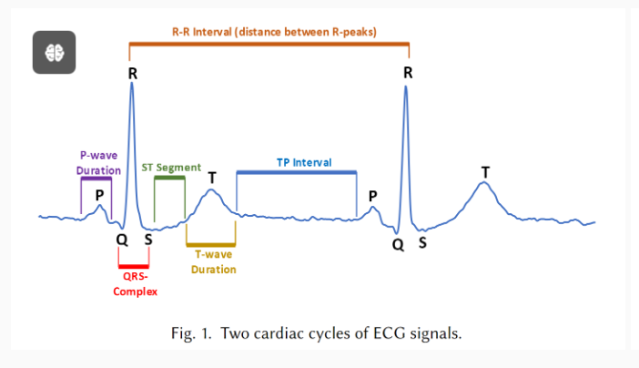

 ## 优化的点：

1.数据的预处理

​	（多去看看心电图（scg）在人工智能领域的应用，了解心电图如何处理之后让神经网络做判断（比如说特征点在哪？

是根据哪几个特征波进行判定？或者说如何找到特征波，心电图诊断已经很成熟，多看看别人的论文什么的，看看哪些特征波可以用到

）)

2.神经网络的选择：

​	目前用的是cnn，但是不一定cnn是最优的，也可以参考别人的心电图诊断论文，看看那种神经网络是最适合的

3.优化器的选择：

​	在神经网络中有优化器的存在，但是是干什么的我也不太清楚，这个需要去查一下学习一下

4.损失函数的选择：

​	在训练过程中，选择好的损失函数可以使模型找到最优解，所以损失函数也是优化整体神经网络的重中之重